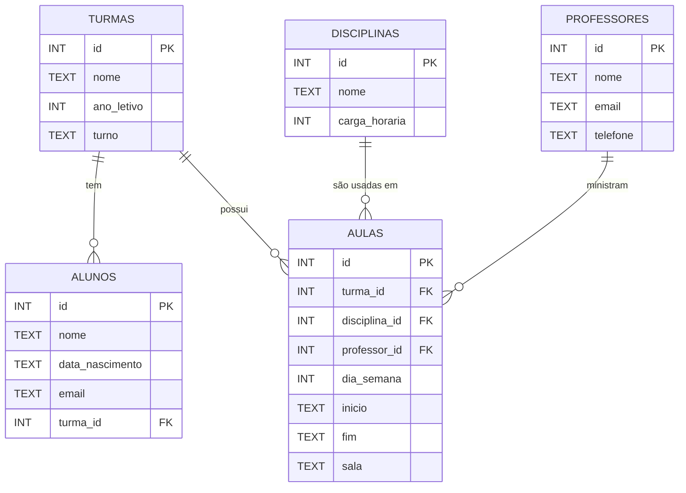

# 🏫 Banco de Dados Escolar — Projeto Lógico (SQL + ER)

Você foi contratado pela **Escola Horizonte** para montar o **banco de dados do sistema acadêmico**.  
A direção quer organizar informações de **alunos**, **turmas**, **disciplinas**, **professores** e **aulas** para planejar horários, distribuir professores, acompanhar matrículas e gerar relatórios.

Este mini‑projeto foi pensado para estudantes do **ensino médio** (linguagem técnica, mas acessível) e cobre:
- **Modelagem lógica** (entidades, atributos, relacionamentos e cardinalidades)
- **DDL em SQL** (criação de tabelas e restrições)
- **Carga de dados de exemplo**
- **Consultas de referência** (JOIN, GROUP BY)
- **Testes simples** com SQLite (opcional)

---

## 🎬 Enunciado — A missão do dev de dados
Implemente o **projeto lógico** do banco de dados da Escola Horizonte com as **5 tabelas** a seguir:

- `alunos`
- `turmas`
- `disciplinas`
- `professores`
- `aulas` (agenda/sessão: qual **professor** ministra qual **disciplina** para qual **turma**, em que **dia/horário** e **sala**)

> **Simplificação proposital:** cada aluno pertence a **uma única turma**. As **aulas** representam a grade semanal (ex.: segunda 08:00–08:50).

### ✅ Requisitos (critérios de aceitação)
- Chaves primárias para todas as tabelas.
- **FKs** consistentes entre as tabelas relacionadas.
- **Restrições** mínimas de integridade (ex.: não permitir quantidade/tempo negativos; dia da semana 1–7; horário fim > início).
- Script SQL de **criação** (`schema.sql`) separado do de **carga** (`seed.sql`).
- **Consultas de referência** em `queries.sql` (ex.: grade de uma turma, carga de aulas por professor, contagem de alunos por turma).
- README explicando **contexto**, **modelo** e **como executar** com SQLite.

---

## 🧠 Entidades & Relacionamentos (visão lógica)
- **Alunos** (1) — pertencem a — (N) **Turmas**  
- **Turmas** (1) — possuem — (N) **Aulas**  
- **Disciplinas** (1) — aparecem em — (N) **Aulas**  
- **Professores** (1) — ministram — (N) **Aulas**

### Diagrama ER (Mermaid)
> Dica: visualize no GitHub (suporta Mermaid) ou em editores online.



---

## 📁 O que está incluído
```
escola-db-projeto-logico/
├─ README.md          # este arquivo
├─ schema.sql         # DDL (criação das tabelas e restrições)
├─ seed.sql           # carga de dados de exemplo
├─ queries.sql        # consultas de referência (SELECTs)
├─ tests/
│  └─ test_db.py      # testes simples com SQLite (opcional)
├─ .gitignore
└─ LICENSE (MIT)
```

---

## 💻 Como executar (SQLite)
> Requer **SQLite** instalado (no macOS e muitas distros Linux já vem embarcado).  
> No Windows, você pode usar `sqlite3` via WSL ou baixar o binário do site oficial.

```bash
# dentro da pasta do projeto
sqlite3 escola.db < schema.sql
sqlite3 escola.db < seed.sql

# Rodar consultas de exemplo
sqlite3 escola.db < queries.sql

# Abrir o shell e explorar
sqlite3 escola.db
-- dentro do shell:
.tables
.headers on
.mode column
SELECT * FROM turmas;
.exit
```

### Rodar testes (opcional, com Python)
```bash
python -m venv .venv && source .venv/bin/activate   # Windows: .venv\Scripts\activate
pip install pytest
pytest -q
```

---

## 🧪 Consultas sugeridas (incluídas em `queries.sql`)
- **Grade de uma turma** (ex.: `1A`) ordenada por dia/horário.  
- **Trabalho do professor**: aulas por professor e por disciplina.  
- **Painel da direção**: alunos por turma; total de aulas por turma/semana.  
- **Descobrir conflitos**: (desafio) duas aulas da mesma turma no mesmo dia/horário.

---

## 🚀 Extensões (para próximos passos)
- Adicionar tabela **salas** e relacionar com `aulas`.  
- Controlar **capacidade** das turmas e **lotação** das salas.  
- Registrar **notas** e **frequência** (tabelas: `avaliacoes`, `frequencias`).  
- Migrar para **PostgreSQL** e criar **views** e **índices** dedicados.

---

## 📝 Licença
Projeto sob **MIT** — aprendizado aberto e colaborativo. ✨
